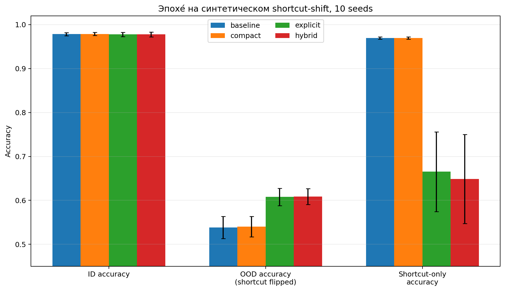
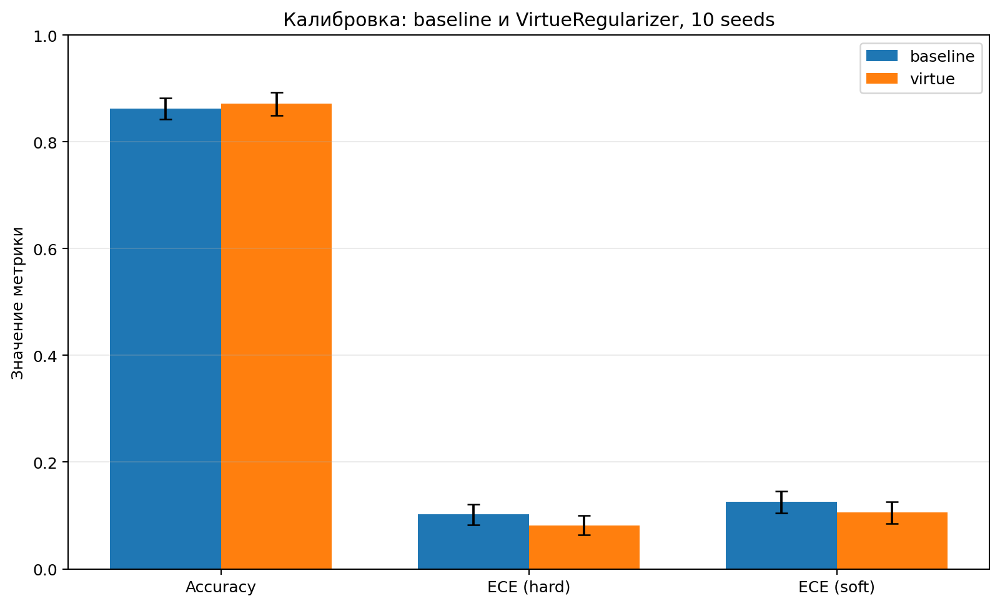

# Платон обучал нейросети две тысячи лет назад — просто не выложил `requirements.txt`

У меня была простая мысль, из тех, которые сначала кажутся гениальными, а потом оставляют после себя сорок вкладок, три книги Гуссерля и подозрительно тихий GPU.

Нейросетям в современном виде — несколько десятилетий. А вопросом «как вообще возникает знание?» люди занимаются больше двух тысяч лет. Значит, рассуждал я, где-то между Платоном, Аристотелем, Пирсом, Гегелем и Гадамером наверняка лежит забытый метод обучения. Осталось перевести его с философского на PyTorch, вызвать `backward()` и ждать SOTA.

План был отличный.

Я взял список методов машинного обучения, наложил его на философские теории познания и сначала получил двенадцать «неиспользованных» идей. Потом начал проверять литературу — и половина списка исчезла.

Абдукция Пирса уже живёт в Abductive Learning и нейросимвольных системах. Скептическое воздержание от суждения называется selective prediction. Воплощённое познание ездит по лабораториям в роботах. Телеология устроилась в goal-conditioned reinforcement learning. Даже диалектика уже добралась до отдельных алгоритмических работ.

То есть бесплатного optimizer у Платона не нашлось.

Зато обнаружилось кое-что полезнее: философия чаще даёт машинному обучению не готовые алгоритмы, а **постановки задач**. «Что значит знать пределы своего знания?», «как понять часть через целое?», «как сохранить оба полюса противоречия?», «что останется, если временно отключить привычную предпосылку?» — это уже почти техническое задание. Не хватает состояния, оператора, функции потерь и эксперимента, в котором идея может проиграть.

В этой статье я разделю философские аналогии на три класса, затем разберу шесть механизмов, которые всё ещё формализованы лишь частично, и покажу объединённый PyTorch-модуль. В отличие от первой версии, здесь есть не только формулы и тесты, но и два воспроизводимых синтетических эксперимента.

> **Дисклеймер честности.** Я не утверждаю, что тензор «понимает» Гуссерля или обладает добродетелью. Ниже — инженерные операционализации: измеримые прокси, вдохновлённые философскими постановками. Философское сходство не доказывает историческое происхождение и не превращает регуляризатор в сознание.

<cut />

## Как отличить метод от красивой метафоры

Очень легко сказать, что attention — это герменевтика, GAN — Гегель, а pretraining — платоновское припоминание. После этого остаётся только назвать dropout стоицизмом и закрыть исследовательскую программу.

Я использую более скучный, но полезный критерий. Философская идея становится техническим методом, когда для неё можно предъявить четыре вещи:

1. **вычислимое состояние** — что именно хранит модель;
2. **оператор изменения** — как состояние обновляется;
3. **оптимизируемую цель** — loss, reward, posterior или иной критерий;
4. **опровержимый эксперимент** — датасет, baseline и метрику, на которой новая конструкция может проиграть обычному `CrossEntropyLoss`.

Если последнего пункта нет, перед нами не алгоритм, а подпись к архитектурной схеме.

### Категория 1. Философская задача уже получила инженерный ответ

| Философская постановка | Технический аналог | Что действительно совпадает |
|---|---|---|
| Эмпиризм | supervised и self-supervised learning | структура извлекается из опыта и повторяющихся связей |
| Прагматизм | reinforcement learning | знание проверяется действием и последствиями |
| Эволюционная эпистемология | нейроэволюция, population-based search | вариации, отбор и удержание удачных решений |
| Абдукция | Abductive Learning, DeepProbLog, multiple-hypothesis models | выбор объяснения по данным и ограничениям |
| Скептическое воздержание | selective prediction, reject option, learning to defer | модель может не отвечать при высоком риске |
| Воплощённое познание | embodied RL, vision-language-action models | представления связываются с сенсорами и действием |
| Телеология | goal-conditioned RL, UVFA, control as inference | цель входит в value function или вероятностную модель |
| Интеллектуальное смирение | calibration, uncertainty estimation | уверенность сопоставляется с реальной частотой ошибок |

Это не означает, что современные инженеры тайно конспектировали Аристотеля. Связь структурная, а не генеалогическая.

### Категория 2. Аналогия полезна как язык, но не как родословная

* **Attention = герменевтический круг.** Attention вычисляет взвешенную сумму. Сам по себе он не обязан переосмысливать целое через части, а затем части через обновлённое целое.
* **Backprop = диалектическое снятие.** Backprop — цепное правило. Противоречие, сохранение обоих полюсов и порождение третьего представления из него не следуют из дифференцирования.
* **Neural ODE = процессуальная философия Уайтхеда.** Здесь есть удобный язык «становления», но математика выросла из численного анализа и динамических систем.
* **Pretraining = анамнесис.** Предобученные веса действительно дают заранее сформированную структуру, но это не врождённые эйдосы, а статистика предыдущих данных.

Правило получилось простое: философия может дать **язык описания**, **постановку задачи** или **реальный вычислительный механизм**. Смешивать эти уровни нельзя.

### Категория 3. Соседние методы есть, но центральный процесс не стал стандартной objective

После аудита у меня осталось шесть интересных направлений:

1. феноменологическое эпохе́;
2. герменевтический круг;
3. диалектическое снятие;
4. перспективизм, объединённый с воздержанием;
5. эпистемология добродетелей как связанная система целей;
6. пирсовский семиозис.

Абдукцию я оставил в библиотеке как контрольный пример: она не нова, но хорошо показывает, как философский критерий превращается в дифференцируемую процедуру.

---

# 1. Абдукция: контрольный пример «лучшего объяснения»

Пирс различал дедукцию, индукцию и абдукцию. Абдукция не просто обобщает наблюдения, а выбирает гипотезу, которая лучше всего их объясняет.

Для набора кандидатов можно записать прозрачный балл:

$$
S(h)=\log p(\mathrm{obs}\mid h)
-\lambda_S\,\operatorname{complexity}(h)
-\lambda_C\,\operatorname{conflict}(h).
$$

Здесь одновременно появляются правдоподобие, бритва Оккама и согласие с фоновым знанием. Мягкий выбор — `softmax(S/τ)`, жёсткий обучаемый выбор — Gumbel-softmax.

Но нейросеть часто не получает готовый список гипотез. Она сама порождает $K$ вариантов. Тогда удобно перейти к энергии:

$$
E_k=\operatorname{CE}(z_k,y)+\lambda_K\Omega(h_k),
$$

$$
\mathcal L_{\mathrm{softmin}}
=-\tau\log\sum_{k=1}^{K}\exp(-E_k/\tau)+\tau\log K.
$$

Чтобы все слоты не выдали одно и то же объяснение, добавляются diversity- и balance-члены:

$$
\mathcal L_{\mathrm{abd}}=
\mathcal L_{\mathrm{softmin}}+
\lambda_D\mathcal L_{\mathrm{div}}+
\lambda_B D_{KL}(u\Vert U_K).
$$

В модуле есть оба интерфейса:

* `AbductiveScorer` — для уже сформированных гипотез;
* `AbductiveHypothesisLoss` — для банка нейронных гипотез.

Это полезная инженерная конструкция, но не моя заявка на изобретение абдукции.

---

# 2. Эпохе́: сначала надо уточнить, что именно мы выносим за скобки

У Гуссерля эпохе́ — это приостановка привычного суждения, попытка временно не принимать усвоенную установку за само явление.

При переводе на ML обнаружилась важная развилка. Слово «bracketing» скрывает **две разные задачи**.

## 2.1. Удаление самого свидетельства

Пусть $p_{full}$ — ответ на реальном входе, а $p_{0}$ — ответ без информации о конкретном явлении. Тогда свидетельство должно действительно менять вывод:

$$
G=JS(p_{full}\Vert p_0),
$$

$$
\mathcal L_{gain}=\max(0,m-G).
$$

JS ограничена сверху, а hinge перестаёт увеличивать расхождение после достижения порога. Это лучше, чем бездумно максимизировать KL и учить модель раздувать логиты.

Так работает компактный `EpocheRegularizer`. Он полезен, когда вопрос звучит: **«модель вообще смотрит на текущий вход или отвечает из общей привычки?»**

Но этот метод не знает, какая конкретно часть входа является ложным prior.

## 2.2. Удаление подозрительного shortcut при сохранении свидетельства

Представим вход как $x=(e,s)$, где $e$ — полезное свидетельство, а $s$ — подозрительный prior: фон изображения, стиль документа, идентификатор устройства, ведомственный шаблон.

Нужны три, а лучше четыре режима:

$$
z=f_\theta(e,s),
$$

$$
z^\circ=f_\theta(e,\operatorname{bracket}(s)),
$$

$$
z^\pi=f_\theta(0,s),
$$

$$
z^0=f_\theta(0,0).
$$

* $z$ — обычный ответ;
* $z^\circ$ — ответ после удаления подозрительного shortcut;
* $z^\pi$ — что модель способна узнать только из prior;
* $z^0$ — ответ без индивидуального свидетельства вообще.

Объединённая objective:

$$
\mathcal L_{base}=
\operatorname{CE}(z,y)+
\alpha\operatorname{CE}(z^\circ,y)+
\beta\operatorname{JS}(p\Vert p^\circ)+
\gamma D_{KL}(p^\pi\Vert U_C).
$$

$$
\mathcal L_{epoche}=
\mathcal L_{base}+
\delta\max\left(0,m-\operatorname{JS}(p\Vert p^0)\right).
$$

Первые три члена требуют работать без shortcut и сохранять решение. Четвёртый проверяет, что prior сам по себе не выдаёт класс. Пятый — опциональный — требует, чтобы настоящее свидетельство отличало ответ от режима «ничего не видел».

Это не универсальная кнопка `remove_bias=True`. Человек обязан заранее определить, **какую предпосылку он считает подозрительной**. Если возраст пациента причинно значим, превращать его в равномерный шум — не объективность, а порча данных.

## 2.3. Что показал синтетический shortcut-shift

Я проверил четыре режима на бинарной задаче. В train shortcut совпадал с классом в 97% случаев, а в OOD-тесте его знак переворачивался. Результаты усреднены по десяти seeds:

| Метод | ID accuracy | OOD accuracy | Accuracy только по shortcut |
|---|---:|---:|---:|
| CE baseline | 0.9784 ± 0.0038 | 0.5382 ± 0.0252 | 0.9695 ± 0.0028 |
| Evidence-gain | 0.9789 ± 0.0037 | 0.5404 ± 0.0233 | 0.9695 ± 0.0028 |
| 3-view Epoche | 0.9778 ± 0.0049 | 0.6078 ± 0.0198 | 0.6654 ± 0.0908 |
| Hybrid Epoche | 0.9779 ± 0.0055 | 0.6088 ± 0.0180 | 0.6488 ± 0.1015 |



Главный результат здесь не «эпохе победило». Он скромнее и полезнее: **две формулы решают разные задачи**. Компактный вариант заставляет вход влиять на ответ, но не отличает полезный признак от shortcut. Явное разбиение входа делает именно это и заметно улучшает OOD, почти не меняя ID accuracy.

При этом 0.61 — далеко не идеальная устойчивость. Метод уменьшил зависимость от shortcut, но не устранил её. Это исследовательский сигнал, а не готовый debiasing-рецепт.

---

# 3. Герменевтический круг: целое меняет части, части меняют целое

Шлейермахер и Гадамер описывают понимание как движение: смысл целого складывается из частей, но смысл каждой части пересматривается после появления целого.

Один attention-проход этого не гарантирует. Нужна траектория состояний.

Пусть есть представления частей:

$$
h_1^0,\ldots,h_N^0\in\mathbb R^d,
$$

и представление целого:

$$
g^0=\operatorname{Pool}(h_1^0,\ldots,h_N^0).
$$

На каждом обороте сначала обновляем целое:

$$
g^{t+1}=G_\theta\left(g^t,\operatorname{Pool}(h_1^t,\ldots,h_N^t)\right),
$$

затем переинтерпретируем части:

$$
h_i^{t+1}=H_\phi(h_i^t,g^{t+1}).
$$

Основная задача считается по финальному целому. Дополнительно нужны согласованность и приближение к фиксированной точке:

$$
\mathcal L_{circle}=
\frac1T\sum_{t=1}^{T}
\left\|g^t-\operatorname{Pool}(h_1^t,\ldots,h_N^t)\right\|_2^2,
$$

$$
\mathcal L_{fp}=\frac12\left(
\|g^T-g^{T-1}\|_2^2+
\frac1N\sum_i\|h_i^T-h_i^{T-1}\|_2^2
\right),
$$

$$
\mathcal L_{herm}=\mathcal L_{task}+
\lambda_C\mathcal L_{circle}+
\lambda_F\mathcal L_{fp}.
$$

В объединённой библиотеке два уровня сложности:

* `HermeneuticConsistency` — лёгкий параметрически почти бесплатный цикл: целое пересчитывает attention по частям и смешивается с их агрегатом;
* `HermeneuticRefiner` — полноценный двусторонний блок на GRUCell, обновляющий и части, и целое; `HermeneuticCircleLoss` добавляет consistency, fixed-point и контроль траектории.

Лёгкая версия удобна для быстрого эксперимента. Полная ближе к философской постановке, потому что меняет не только вес части, но и её представление.

Главная ловушка — collapse. Если все $h_i$ и $g$ станут одной константой, внутренняя согласованность будет прекрасной, а задача — мёртвой. Поэтому $\mathcal L_{task}$ и внешние anti-collapse ограничения обязательны.

---

# 4. Диалектическое снятие: не выбрать победителя, а построить третье представление

Слово *Aufhebung* неудобно тем, что одновременно означает отмену, сохранение и поднятие на новый уровень. Для ML это можно перевести так:

1. там, где тезис и антитезис согласны, не разрушать общее;
2. там, где они конфликтуют, не усреднять автоматически и не выбирать один полюс;
3. новый синтез должен быть полезен для задачи.

Пусть $a,b\in\mathbb R^d$. Оценим согласие покоординатно:

$$
m_j=\exp\left(-\frac{|a_j-b_j|}{\tau}\right).
$$

В первой версии признаки были $[a,b,a-b,a\odot b]$. Это делало оператор чувствительным к тому, какой полюс назван тезисом. В новой версии по умолчанию используются симметричные признаки:

$$
\xi=\left[
\frac{a+b}{2},
|a-b|,
a\odot b,
\frac{a^2+b^2}{2}
\right].
$$

Из них строится «поднятие»:

$$
r=\frac{a+b}{2}+\gamma\tanh S_\phi(\xi),
$$

и обучаемый предохранительный gate:

$$
u=\sigma(W_u\xi+b_u),
$$

$$
\tilde r=u\odot r+(1-u)\odot\frac{a+b}{2}.
$$

Финальный синтез:

$$
z=m\odot\frac{a+b}{2}+(1-m)\odot\tilde r.
$$

Loss состоит из четырёх частей:

$$
\mathcal L_{auf}=\ell(z,y)+
\lambda_P\mathcal L_{pres}+
\lambda_R\mathcal L_{res}+
\lambda_N\mathcal L_{nov}.
$$

* **Preservation** удерживает общее там, где родители согласны.
* **Resolution** требует, чтобы синтез был не хуже лучшего родителя:

$$
\mathcal L_{res}=\max\left(0,\ell(z,y)+\delta-\min(\ell(a,y),\ell(b,y))\right).
$$

* **Novelty** не позволяет во всех конфликтных координатах прятаться в midpoint.

Это пригодится при конфликтующих сенсорах, двух экспертных моделях, несовпадающих модальностях или multi-task представлениях. Но «новизна latent-кода» сама по себе ничего не доказывает. Если синтез необычный, но задача не улучшилась, мы получили современное искусство, а не новый метод обучения.

---

# 5. Перспективизм плюс скепсис: несколько взглядов и право не отвечать

Обычный ensemble усредняет головы и часто скрывает сам факт конфликта. Перспективистский механизм должен сохранить разногласие как отдельное состояние.

Пусть $K$ голов выдают $p_k(y\mid x)$. Для измерения конфликта можно использовать bounded Jensen–Shannon divergence или mutual information:

$$
D(x)=H\left(\frac1K\sum_k p_k\right)-\frac1K\sum_k H(p_k).
$$

Затем:

$$
\operatorname{abstain}(x)=\mathbf 1[D(x)>\tau].
$$

В `PerspectivalEnsemble` доступны JS, mutual information и симметричная KL. По умолчанию используется JS, потому что она ограничена и не взрывается, когда одна голова присваивает событию почти нулевую вероятность.

Здесь важно не максимизировать разногласие. Полный хаос — не перспективизм, а сломанный ensemble. Для неоднозначных или OOD-примеров можно таргетировать ненулевой уровень disagreement, а на простых примерах требовать согласия. Воздержание оценивается через risk–coverage, а не количеством красивых фраз «я не уверен».

---

# 6. Эпистемические добродетели: не всё надо максимизировать

Эпистемология добродетелей говорит о качествах познающего: надёжности, интеллектуальном смирении, честности, открытости к возражениям, аккуратности.

Здесь я объединил две идеи из предыдущих вариантов.

## 6.1. Прямой операциональный loss

`EpistemicVirtueLoss` складывает измеримые требования:

$$
\mathcal L_{virtue}=
\mathcal L_{acc}+
\alpha\mathcal L_{cal}+
\beta\mathcal L_{hum}+
\gamma\mathcal L_{hon}+
\eta\mathcal L_{open}+
\zeta\mathcal L_{sel}.
$$

### Точность

$$
\mathcal L_{acc}=-\frac1B\sum_i\log p_i(y_i).
$$

### Калибровка

Используется Brier score как proper scoring rule:

$$
\mathcal L_{cal}=
\frac1B\sum_i\|p_i-\operatorname{onehot}(y_i)\|_2^2.
$$

### Смирение

Штрафуется высокая уверенность именно на текущих ошибках:

$$
\mathcal L_{hum}=
\frac{\sum_i\mathbf1[\hat y_i\ne y_i]\,\max(0,c_i-c_0)^2}
{\sum_i\mathbf1[\hat y_i\ne y_i]+\varepsilon}.
$$

### Честность

Если для примера есть оценка доказательной опоры $q_i$, уверенность не должна систематически её превышать:

$$
\mathcal L_{hon}=\frac1B\sum_i\max(0,c_i-q_i)^2.
$$

### Открытость к контрдоказательству

Существенный counterfactual должен менять ответ, несущественный — не должен:

$$
\mathcal L_{open}=\frac1B\sum_i\left[
 r_i\max\left(0,m-\operatorname{JS}(p_i\Vert p'_i)\right)^2+
 (1-r_i)\operatorname{JS}(p_i\Vert p'_i)^2
\right].
$$

### Воздержание

Для accept-head $a_i$:

$$
R_{sel}=\frac{\sum_i a_i\ell_i}{\sum_i a_i+\varepsilon},
$$

$$
\mathcal L_{cov}=\max\left(0,\kappa-\frac1B\sum_i a_i\right)^2.
$$

## 6.2. Добродетель как целевой режим, а не максимум

Второй вариант статьи предложил аристотелевскую «золотую середину»:

$$
\sum_v\beta_v\left(V_v-V_v^{\mathrm{target}}\right)^2.
$$

Идея сильная, но её нельзя применять ко всему одинаково.

* **Calibration error** — монотонный дефект. Идеал близок к нулю; «слишком хорошей калибровки» нет.
* **Разногласие ансамбля**, чувствительность к новому свидетельству, степень воздержания и гладкость действительно могут иметь внутренний оптимум. Слишком мало — догматизм, слишком много — хаос или легковерие.

Поэтому `VirtueRegularizer` разделяет эти случаи. Soft-ECE таргетируется около нуля, а ensemble mutual information или гладкость могут иметь ненулевой target. Для гладкости используется Hutchinson-оценка нормы полного якобиана, а не градиент суммы выходов, где направления способны взаимно сократиться.

## 6.3. Проверка калибровки

Исходный компактный вариант приводил один seed: accuracy 0.873 → 0.874, «ECE» 0.120 → 0.101, средняя уверенность 0.965 → 0.949. Я воспроизвёл эти числа.

При аудите выяснилась тонкость: функция называлась ECE, но использовала мягкое треугольное распределение по bins. Это хороший differentiable proxy, но не классический hard-binned ECE. В новой версии обе метрики разделены.

Результаты на десяти seeds:

| Метод | Accuracy | Hard ECE ↓ | Soft ECE ↓ | Mean confidence |
|---|---:|---:|---:|---:|
| Baseline | 0.8629 ± 0.0199 | 0.1018 ± 0.0189 | 0.1253 ± 0.0207 | 0.9636 ± 0.0021 |
| + virtue | 0.8714 ± 0.0216 | 0.0814 ± 0.0180 | 0.1052 ± 0.0202 | 0.9517 ± 0.0040 |

| Метод | NLL ↓ | Brier ↓ |
|---|---:|---:|
| Baseline | 0.6623 ± 0.1542 | 0.2340 ± 0.0361 |
| + virtue | 0.4600 ± 0.1145 | 0.2059 ± 0.0357 |



На этой синтетической задаче regularizer снизил обе версии ECE, NLL и Brier, а accuracy не просела. Но это всё ещё маленький full-batch MLP на искусственных данных. Результат показывает, что objective работает в заявленном направлении, а не то, что Аристотель победил temperature scaling.

---

# 7. Пирсовский семиозис: знак, объект и интерпретант как рекурсивное состояние

В обычном multimodal learning текст и изображение часто просто сближаются в latent space. У Пирса отношение трёхчастное: знак относится к объекту через интерпретант, а интерпретант способен стать новым знаком и запустить следующую интерпретацию.

Пусть $s$ — знак, $o$ — объект:

$$
i^0=I_\phi(s,o),
$$

$$
s^1=G_\psi(i^0,o),
$$

$$
i^1=I_\phi(s^1,o).
$$

Чтобы интерпретант не стал свободно плавающей константой, добавляются реконструкции:

$$
\hat s=D_s(o,i^0),\qquad \hat o=D_o(s,i^0),
$$

рекурсивная согласованность:

$$
\mathcal L_{rec}=1-\cos(i^0,i^1),
$$

и VICReg-подобные anti-collapse члены:

$$
\mathcal L_{var}=\frac1d\sum_j\max\left(0,\sigma_0-\operatorname{Std}(i_j)\right)^2,
$$

$$
\mathcal L_{cov}=\frac1d\sum_{j\ne k}\operatorname{Cov}(i)_{jk}^2.
$$

Полная цель:

$$
\mathcal L_{sem}=\mathcal L_{task}+
\lambda_S\|s-\hat s\|_2^2+
\lambda_O\|o-\hat o\|_2^2+
\lambda_R\mathcal L_{rec}+
\lambda_V\mathcal L_{var}+
\lambda_C\mathcal L_{cov}.
$$

В коде это `TriadicSemiosis` и `SemiosisLoss`. Лучшие тесты для идеи — compositional generalization, multimodal retrieval и ситуации, где один и тот же знак меняет смысл в зависимости от объекта и предыдущего интерпретанта.

---

# Что получилось в `philosophia-torch` 1.0

Объединённый пакет сохраняет практичность короткого варианта и техническую глубину длинного.

**Каталог компонентов:**

* **`AbductiveScorer`** — ранжирует готовые гипотезы по likelihood, сложности и конфликту с фоновым знанием; сохраняет компактную интерпретируемую формулу.
* **`AbductiveHypothesisLoss`** — обучает банк нейронных гипотез через soft-min, diversity и balance; взят из подробной версии.
* **`EpocheRegularizer`** — проверяет, влияет ли текущее свидетельство на ответ; сохраняет удобную wrapper-реализацию.
* **`EpocheLoss`** — разделяет full, bracketed, prior-only и no-evidence режимы; добавляет точное различение evidence и shortcut.
* **`HermeneuticConsistency`** — лёгкий attention-цикл для быстрого plug-in эксперимента.
* **`HermeneuticRefiner` + `HermeneuticCircleLoss`** — двусторонне обновляют части и целое и контролируют fixed point.
* **`DialecticalSynthesis` + `DialecticalLoss`** — объединяют симметричный synthesis, обучаемый gate, preservation, resolution и novelty.
* **`PerspectivalEnsemble`** — хранит disagreement как отдельное состояние и поддерживает abstention.
* **`VirtueRegularizer`** — объединяет soft-ECE, целевой disagreement и Hutchinson-оценку Jacobian smoothness.
* **`EpistemicVirtueLoss`** — связывает accuracy, Brier, humility, honesty, openness и selectivity.
* **`TriadicSemiosis` + `SemiosisLoss`** — реализуют цикл «знак → объект → интерпретант → новый знак».
* **`PhilosophiaWrapper`** — подключает регуляризаторы поверх произвольного `nn.Module` без переписывания базовой модели.

## Быстрый старт

```python
import torch
import torch.nn as nn
import torch.nn.functional as F

from philosophia_torch import PhilosophiaWrapper

base = nn.Sequential(
    nn.Linear(20, 64),
    nn.ReLU(),
    nn.Linear(64, 4),
)

model = PhilosophiaWrapper(
    base,
    use_virtue=True,
    virtue_kwargs={
        "target_ece": 0.01,
        "beta_calibration": 8.0,
        "target_open": None,
    },
)

logits = model(x)
loss = F.cross_entropy(logits, y) + model.aux_loss(x, logits, targets=y)
loss.backward()
```

Для явного эпохе́ wrapper недостаточен: нужно самому сформировать предметно осмысленные views.

```python
from philosophia_torch import EpocheLoss

objective = EpocheLoss(
    bracketed_task_weight=1.0,
    consistency_weight=0.5,
    prior_uniformity_weight=1.0,
)

out = objective(
    full_logits,
    target,
    bracketed_logits,
    prior_only_logits=prior_only_logits,
)

out.loss.backward()
print(out.detached_terms())
```

## Проверка кода

Пакет содержит:

* однофайловую версию `philosophia_torch.py`;
* совместимые импорты `from philosophia import ...` и `from philosophical_learning import ...`;
* два воспроизводимых demo;
* JSON с результатами каждого seed;
* 45 unit tests.

Тесты проверяют не только формы тензоров и наличие градиента, но и точное совпадение формул, маски, fixed-point член, bounded JS, swap-invariance диалектического синтеза, abstention и старые API обоих прототипов.

```bash
pip install torch pytest
PYTHONPATH=. python -m pytest -q
# 45 passed

PYTHONPATH=. python examples/demo_calibration.py --seeds 10
PYTHONPATH=. python examples/demo_shortcut_epoche.py --seeds 10
```

---

# Что эти эксперименты доказывают — и чего не доказывают

Они доказывают три узких вещи.

1. Калибровочный regularizer действительно меняет оптимизацию в ожидаемую сторону на синтетической задаче и не является мёртвым слагаемым.
2. Явное выделение shortcut принципиально отличается от абстрактного требования «пусть вход влияет на ответ».
3. Все предложенные блоки дифференцируемы и могут быть подключены к PyTorch-модели без переписывания autograd.

Они не доказывают, что:

* методы превосходят IRM, GroupDRO, conformal prediction, SelectiveNet, Deep Ensembles, DEQ или обычный хорошо настроенный Transformer;
* философские названия являются единственно правильной интерпретацией формул;
* внутренне согласованное представление равно пониманию;
* один synthetic benchmark переносится на медицину, право, роботов или LLM.

Для каждого метода нужен отдельный falsification plan:

* **Эпохе́.** Датасеты: Waterbirds, Colored MNIST, domain-shift documents. Baselines: ERM, IRM, GroupDRO. Провал: OOD не улучшается при той же ID accuracy.
* **Герменевтика.** Датасеты: long-document QA, part–whole vision, graphs. Baselines: recurrent refinement, Universal Transformer, DEQ. Провал: лишние итерации без прироста.
* **Диалектика.** Датасеты: conflicting sensors, experts, multimodal disagreement. Baselines: average, gated fusion, MoE. Провал: synthesis не лучше лучшего родителя.
* **Перспективизм.** Датасеты: ambiguous/OOD classification. Baselines: Deep Ensembles, SelectiveNet. Провал: risk–coverage не улучшается.
* **Добродетели.** Датасеты: CIFAR-C, noisy labels, RAG QA. Baselines: CE, temperature scaling, ensembles. Провал: calibration улучшается ценой бесполезной accuracy.
* **Семиозис.** Датасеты: CLEVR и multimodal compositional tasks. Baselines: CLIP-like fusion, cycle consistency. Провал: интерпретант схлопывается или не помогает задаче.

Если герменевтический цикл сведётся к трём лишним проходам — это результат. Если диалектический synthesis окажется дорогим gated average — тоже результат. Философская красота не освобождает гипотезу от обязанности проигрывать.

---

# Что в итоге

Первый вывод оказался неприятным для авторского самолюбия, но полезным для исследования: прежде чем писать «этого нет в ML», надо искать не философское название, а инженерный механизм.

Второй вывод: наиболее интересные пробелы находятся не в готовых ответах, а в **процессах обучения**. Не «модель не уверена», а как она учится воздерживаться. Не «есть контекст», а как целое заставляет перечитать часть. Не «две сети спорят», а как конфликт сохраняется и превращается в новый полезный representation.

Третий вывод: объединение двух версий оказалось полезнее выбора победителя. Короткая версия дала сильный Habr-ритм, wrapper, perspectivism, 23 теста и первый измеримый результат. Длинная — точные многочастные objectives, семиозис, failure modes, расширенную техническую базу и формулы, которые можно сверить с кодом. В версии 1.0 они наконец перестали спорить и выполнили собственное диалектическое снятие.

Платон, конечно, обучал нейросети две тысячи лет назад. Просто, зараза, не приложил `requirements.txt`.

---

# Литература и техническая база

1. Dai W.-Z. et al. **Bridging Machine Learning and Logical Reasoning by Abductive Learning**, NeurIPS 2019.
2. Manhaeve R. et al. **DeepProbLog: Neural Probabilistic Logic Programming**, NeurIPS 2018.
3. Bhagavatula C. et al. **Abductive Commonsense Reasoning**, ICLR 2020.
4. Geifman Y., El-Yaniv R. **Selective Classification for Deep Neural Networks**, NeurIPS 2017.
5. Geifman Y., El-Yaniv R. **SelectiveNet**, ICML 2019.
6. Arjovsky M. et al. **Invariant Risk Minimization**, 2019.
7. Tishby N., Zaslavsky N. **Deep Learning and the Information Bottleneck Principle**, 2015.
8. Geirhos R. et al. **ImageNet-trained CNNs are biased towards texture**, ICLR 2019.
9. Bahng H. et al. **Learning De-biased Representations with Biased Representations**, ICML 2020.
10. Dehghani M. et al. **Universal Transformers**, ICLR 2019.
11. Bai S., Kolter J. Z., Koltun V. **Deep Equilibrium Models**, NeurIPS 2019.
12. Yu T. et al. **Gradient Surgery for Multi-Task Learning**, NeurIPS 2020.
13. Hu Z. **Dialectics for Artificial Intelligence**, 2025.
14. Goodfellow I. et al. **Generative Adversarial Nets**, NeurIPS 2014.
15. Lakshminarayanan B. et al. **Deep Ensembles**, NeurIPS 2017.
16. Guo C. et al. **On Calibration of Modern Neural Networks**, ICML 2017.
17. Gneiting T., Raftery A. **Strictly Proper Scoring Rules**, JASA 2007.
18. Sensoy M. et al. **Evidential Deep Learning**, NeurIPS 2018.
19. Bardes A. et al. **VICReg**, ICLR 2022.
20. Zhu J.-Y. et al. **CycleGAN**, ICCV 2017.
21. Radford A. et al. **CLIP**, ICML 2021.
22. He K. et al. **Masked Autoencoders**, CVPR 2022.
23. Muşat B., Andonie R. **Semiotic Aggregation in Deep Learning**, Entropy 22(12), article 1365, 2020.
24. Driess D. et al. **PaLM-E**, 2023.
25. Brohan A. et al. **RT-2**, 2023.
26. Kim M. J. et al. **OpenVLA**, 2024.
27. Schaul T. et al. **Universal Value Function Approximators**, ICML 2015.
28. Levine S. **Reinforcement Learning and Control as Probabilistic Inference**, 2018.
29. Chen R. T. Q. et al. **Neural Ordinary Differential Equations**, NeurIPS 2018.
30. Kirkpatrick J. et al. **Overcoming catastrophic forgetting in neural networks**, PNAS 2017.
